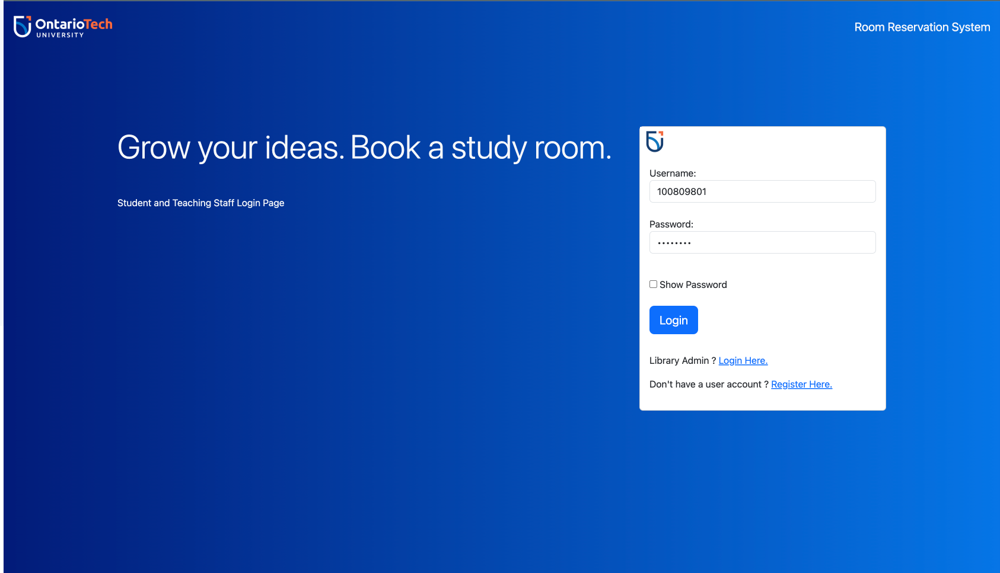

# ROOM BOOKING SYSTEM

**Project description**

The full booking system allows students at Ontario Tech University to book their room of choice from the comfort of their homes

## Table of content

- [Overview](#overview)
  - [Screenshot](#screenshot)
  - [Links](#links)
  - [My process](#my-process)
    - [What I learn](#what-i-learned)
- [Build with](#build-with)
- [Author](#author)
- [Acknowledgements](#acknowledgement)

## Overview

### Screenshot

### Links

- Solution URL: [Github](https://github.com/tin0312/roomBookingSystem)
- Live Site URL: [pythonanywhere](http://roomreservation.pythonanywhere.com/)

### My process

### What I learned

1. Working with flask framework to create web application.
2. Using Jinja template to pass data into final document.
3. Working with mySQL to successfully manipulate tables and data.
4. Work a third party hosting patform to host python application.

## Build with

- Sematic HTML5 markup.
- CSS customed properties.
- Flexbox
- [Bootstrap5](https://getbootstrap.com/docs/5.0/getting-started/introduction/)
- [Flask](https://flask.palletsprojects.com/en/2.3.x/)
- [mySQL](https://www.mysql.com/)
- [Python](https://www.python.org/)
- [PythonAnywhere](https://www.pythonanywhere.com/login/)

## Author

- Hoang Nhat Truong
- Github: [@tin0312](https://github.com/tin0312/roomBookingSystem)

- Twitter: [@justin_hppp](https://twitter.com/justin_hppp)

## Acknowledgement

- My partner at Ontario Tech University.  
- This project was done with discord communication channel, therefore all updates are not available on Github. 
